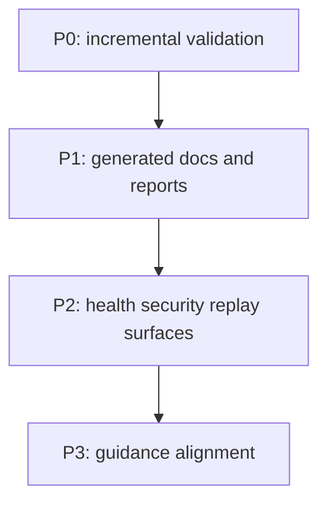

# epyc-llama Readiness Task Index

This file is the coordination point for repo-readiness work in this tree.
It stays docs-only and tracks the smallest actionable set of items needed to keep
the repository ready for downstream use.

## Prioritized Tasks

- [x] P0 - Add incremental validation surfaces for readiness scoring.
  - Key files: [`scripts/gitnexus-analyze.sh`](../scripts/gitnexus-analyze.sh), [`scripts/validate/check_numeric_literals.py`](../scripts/validate/check_numeric_literals.py)
  - Done when: changed-file validation can run without invoking model inference or kernel builds.

- [x] P1 - Add generated-docs and analysis-report refresh surfaces.
  - Key files: [`scripts/docs/generate_readiness_docs_index.py`](../scripts/docs/generate_readiness_docs_index.py), [`scripts/analysis/generate_analysis_reports_index.py`](../scripts/analysis/generate_analysis_reports_index.py)
  - Done when: generated docs can be refreshed and checked deterministically.

- [x] P2 - Add health, security-audit, and replay-analysis workflow surfaces.
  - Key files: [`scripts/session/health_check.sh`](../scripts/session/health_check.sh), [`scripts/security_audit.py`](../scripts/security_audit.py), [`scripts/analysis/replay_analysis.py`](../scripts/analysis/replay_analysis.py)
  - Done when: the L4 health, security, and replay criteria have repo-local commands and report artifacts.

- [ ] P3 - Keep the repo-local guidance aligned with the current tree and policy.
  - Key files: [`AGENTS.md`](../AGENTS.md), [`CLAUDE.md`](../CLAUDE.md), [`README.md`](../README.md)
  - Done when: path names, repo scope, and contributor guidance match the live repository layout.

## Dependency Graph

## Cross-Cutting Concerns

- Keep the repo-readiness surface scripts/docs-only; do not touch kernel source for readiness-only work.
- Treat path names as canonical for this tree: `/mnt/raid0/llm/llama.cpp` is the working repo root used by the current session.
- Re-check the guidance files if the repository layout or repo naming changes, because this index depends on those names staying current.

## Reporting Instructions

- When a task is started or completed, update the checkbox state in this file first.
- Include the changed paths, validation result, and any follow-up notes in the same handoff update.
- If a task needs code or build changes, add the precise target file paths here before editing anything else.

## Key File Locations

- `AGENTS.md`
- `CLAUDE.md`
- `README.md`
- `docs/`
- `scripts/analysis/`
- `scripts/docs/`
- `scripts/session/`
- `scripts/validate/`
- `tools/server/README.md`
