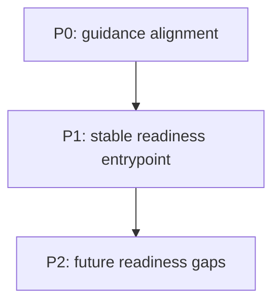

# epyc-llama Readiness Task Index

This file is the coordination point for repo-readiness work in this tree.
It stays docs-only and tracks the smallest actionable set of items needed to keep
the repository ready for downstream use.

## Prioritized Tasks

- [ ] P0 - Keep the repo-local guidance aligned with the current tree and policy.
  - Key files: [`AGENTS.md`](../AGENTS.md), [`CLAUDE.md`](../CLAUDE.md), [`README.md`](../README.md)
  - Done when: path names, repo scope, and contributor guidance match the live repository layout.

- [ ] P1 - Keep the readiness entrypoint stable and discoverable.
  - Key files: [`docs/epyc-llama-readiness-index.md`](./epyc-llama-readiness-index.md)
  - Done when: this file remains the single task-index surface for repo-readiness coordination.

- [ ] P2 - Record any future docs-only readiness gaps here before broader repo work starts.
  - Key files: `docs/`
  - Done when: new readiness items are added here as bounded checklist entries with owners and target paths.

## Dependency Graph

## Cross-Cutting Concerns

- Keep the repo-readiness surface docs-only; do not pull source, build, or generated artifacts into this index.
- Treat path names as canonical for this tree: `/mnt/raid0/llm/llama.cpp` is the working repo root used by the current session.
- Re-check the guidance files if the repository layout or repo naming changes, because this index depends on those names staying current.

## Reporting Instructions

- When a task is started or completed, update the checkbox state in this file first.
- Include the changed paths, validation result, and any follow-up notes in the same handoff update.
- If a task needs code or build changes, add the precise target file paths here before editing anything else.

## Key File Locations

- `AGENTS.md`
- `CLAUDE.md`
- `README.md`
- `docs/`
- `tools/server/README.md`
