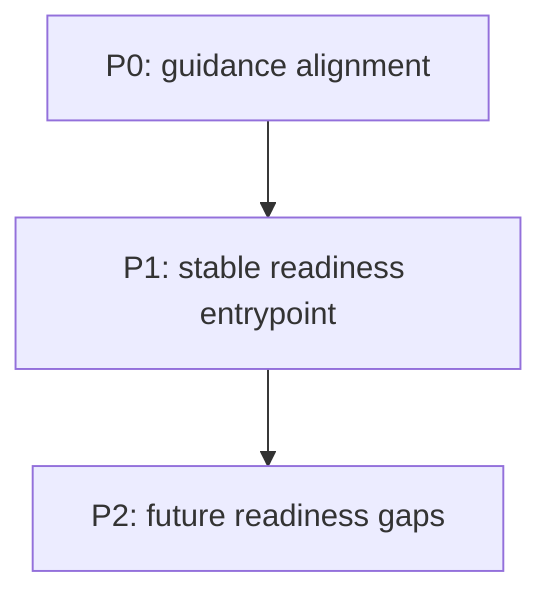

# epyc-llama Readiness Task Index

This is the repo-local coordination point for readiness work in the EPYC
`llama.cpp` fork. Keep this file docs-only: it should identify bounded work and
validation targets, not change source, build, or benchmark behavior.

## Prioritized Task List

- [ ] P0 - Keep repo-local guidance aligned with the current fork.
  - Key files: `AGENTS.md`, `CLAUDE.md`, `README.md`, `docs/ops.md`
  - Done when path names, repo scope, and contributor guidance match the live
    repository layout.

- [ ] P1 - Keep the readiness entrypoint stable and discoverable.
  - Key files: `handoffs/active/master-handoff-index.md`,
    `docs/epyc-llama-readiness-index.md`
  - Done when this handoff remains the task-index surface and the docs copy, if
    kept, points back here.

- [ ] P2 - Record future readiness gaps here before broader repo work starts.
  - Key files: `docs/`, `scripts/`, `tools/server/`
  - Done when new readiness items are added as bounded checklist entries with
    target paths and validation commands.

## Dependency Graph

## Cross-Cutting Concerns

- Keep readiness coordination separate from kernel, server, and benchmark
  changes; this index is not a license to edit source without the owning gate.
- Treat `/mnt/raid0/llm/llama.cpp` as the canonical working tree for this fork.
- Check `docs/ops.md` and `tools/server/README.md` before changing operational
  guidance, because downstream orchestration depends on server behavior.
- Preserve upstream compatibility unless an EPYC-specific fork note explicitly
  owns the divergence.

## Reporting Instructions

- Update this index when a repo-readiness task starts, completes, or gains a
  new dependency.
- Record changed paths, validation commands, and commit hashes in the same
  handoff update.
- If a task needs code or build changes, add the exact target paths here before
  editing.

## Key File Locations

- `AGENTS.md`
- `CLAUDE.md`
- `README.md`
- `docs/`
- `docs/ops.md`
- `tools/server/README.md`
